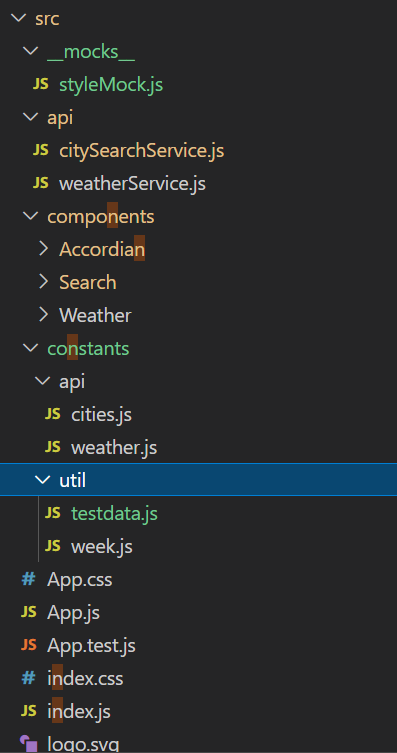
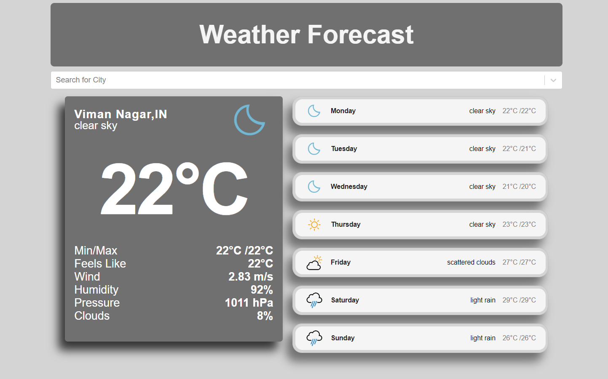
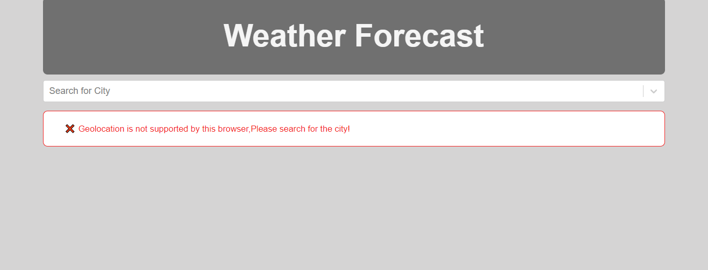
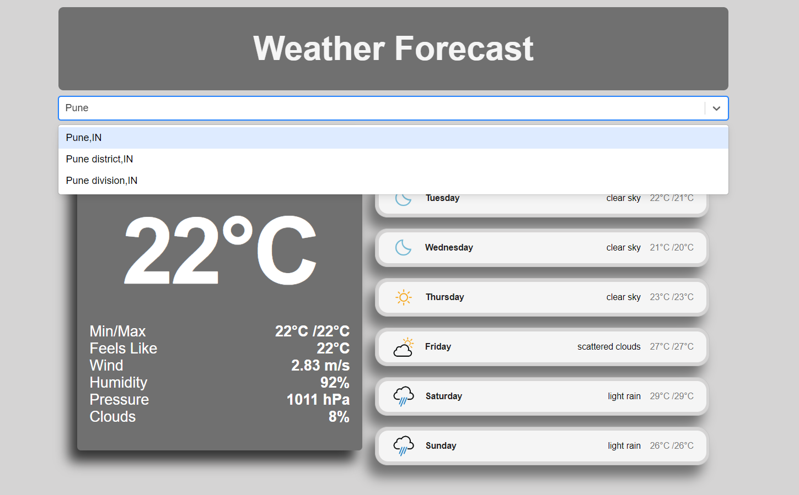
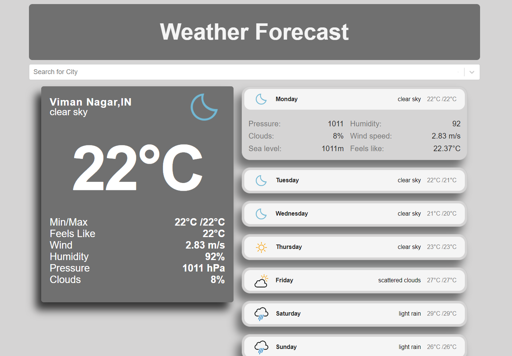
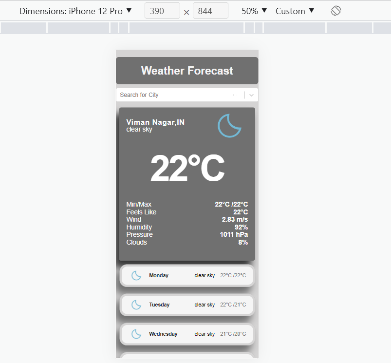
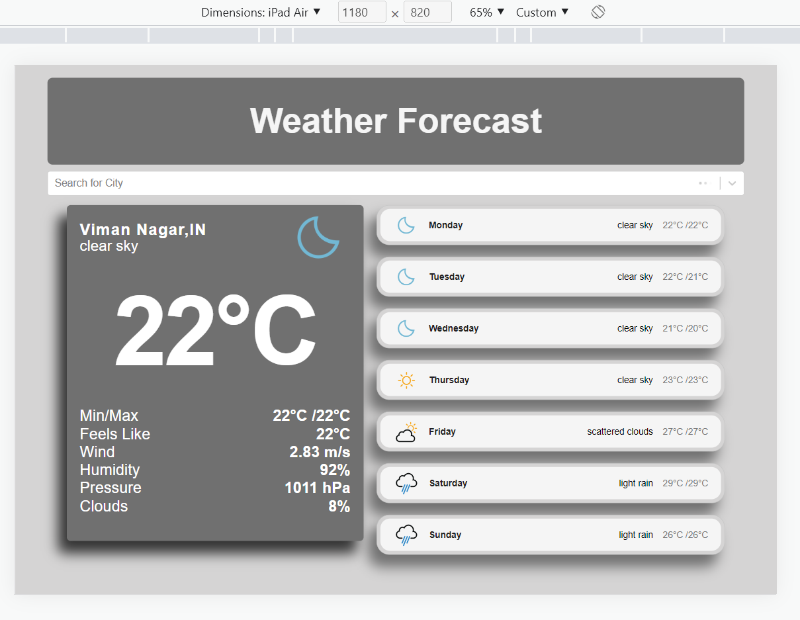
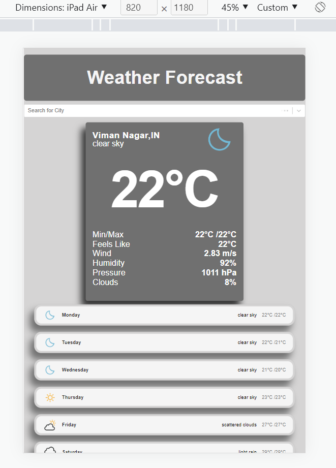

# Simple Implementation of Weather Forecast App

Responsive single page application oriented to display current Weather and 7 day Forecast of different cities with population more than 10000.On page load if Geolocation is supported, it displays the weather and forecast of the current location.

Application is deployed to the URL [WeatherApp](weather-app-nithkish.vercel.app)

The colour palette used is Grey.

## Table of Contents

- [Technologies used](#technologies-used)
- [API Used](#api-used)
- [Testing](#testing)
- [Project Structure](#project-structure)
- [Available Scripts](#available-scripts)
- [Functionality](#functionality)
- [Todo](#todo)

## Technologies used

- [React](https://reactjs.org/) single page application - 18.2.0.
- axios 0.27.2 
- CSS.
- react-select-async-paginate package.
- react-spinners node package.

## API used

- [RapidAPI](https://rapidapi.com/wirefreethought/api/geodb-cities/) geo cities library for cities search bar.(Free account)
- [OpenWeather](https://home.openweathermap.org/) for current weather and forecast.(free Account)
- [Geolocation Web API](https://developer.mozilla.org/en-US/docs/Web/API/Geolocation_API) for accessing current location of the user

## Testing

The testing strategy for this project is based on the following two libraries:

* [react-testing-library](https://github.com/kentcdodds/react-testing-library): these are some testing utilities that allow you to write tests that work with actual DOM nodes. You can think of it as a replacement of the popular [Enzyme](https://github.com/airbnb/enzyme) testing library.
* [Jest](https://jestjs.io/): test runner developed by Facebook, it ships with `create-react-app`. It is also used to mock some of the modules that are required on the tests.
* [axios-mock-adapter](https://www.npmjs.com/package/axios-mock-adapter) Axios adapter that allows to easily mock requests
 
## Project Structure

The project mainly consists of two folders
 - public : which contains the index.html file and all the common assets, like icons,screenshots
 - src: contains the main business logic codes and the structure is as shown below.
  - mocks : contain the files needed for jest library for mocking css.
  - api: folder is used for methods used for api service calls.
  - components:all components are kept inside the components folder and respective unit test files are present.
  - constants: folder consisits of the constants needed for api and other testdata nad utilities.

Other root files like App.js, index.js are kept inside the src folder.

## Available Scripts

In the project directory, you can run:

### `npm install`

To install all the dependencies.This should be the first step post cloning the repository.

### `npm start`

Runs the app in the development mode.\
Open [http://localhost:3000](http://localhost:3000) to view it in the browser.

The page will reload if you make edits.

### `npm run test`

Triggers the complete test suite of the application created using react-testing-library. Jest command is used in the script.

### `npm run build`

Builds the app for production to the `build` folder.\
It correctly bundles React in production mode and optimizes the build for the best performance.

The build is minified and the filenames include the hashes.\
App is ready to be deployed!

## Functionality

 On landing on the application home page, the browser prompts for accessing the location, if the browser supports Geolocation API.On allowing access to the location, the temperature of the current location with other details like description, min/max temp, wind speed etc are displayed. Along with this, a 7 day forecast is displayed for the current location in the right side.

 The search bar below the header can be used to search for any cities having population above 10000. On selecting a particular city, the weather and forecast of the selected city is displayed.

  

 If the Geolocation Api is not available in your browser, the below error message appears on loading.

   

The main functional component of the application consists of below sections.

- Header : "Weather Forecast" header card.
- Search card : search with auto suggestions. Using the react-select-async-paginate package, the search bar with auto suggestion has been implemented.The cities in autosuggestion can only be selected for getting the weather and forecast.

  

- Weather Card : Displays the current Temperature of the selected/current city with the city name adn country code mentioned along with icon indicator of the weather and description. The bottom part of the card shows the details like pressure, wind speed, min/max temp, humidity etc.

- Forecast Section : contains a list of accordian elements whose panel indicates the the upcoming days weather forecast. The top panel shows the indicator icon with the details of the upcoming day of the week, with description of the weather and min/max temperature. The free version of API used only provides 3 hour forecast for few days, so had to consume the first 7 entries as the 7 day forecast.

On clicking the top panel, the accordian bottom panel appears which has more details about the forecast as shown below.
  
  

The page is designed taking into consideration of responsiveness. The application is compatible both in mobile as well as tab screens.

### Mobile Screen

### IPad Screen

## TODO

Add animation/transition effects for all the trasitions.

